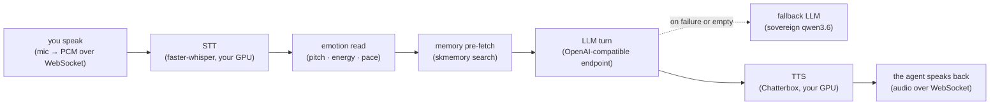
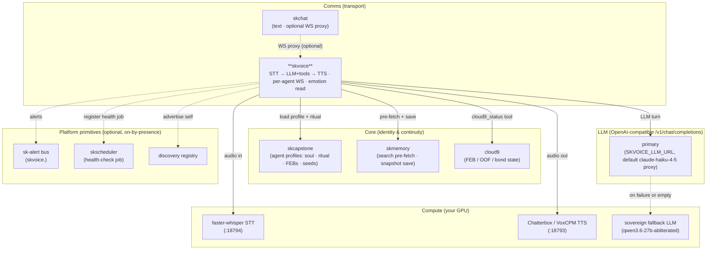

# skvoice — Sovereign Voice Agent Service 🎙️

> **Talk to your agents. On your own hardware. In their own voice.**
> Your speech never leaves the house — STT, the LLM turn, and TTS all run on
> machines you own, and the agent that answers carries its own soul, memories,
> and emotional state.

skvoice is the **voice capability** of the [SKWorld](https://skworld.io)
sovereign agent ecosystem. It is a lightweight **orchestrator**: a FastAPI +
WebSocket service that wires your microphone to a local STT engine, runs the
transcript through a memory-aware, tool-using LLM turn, and streams the agent's
spoken reply back from a local TTS engine. No cloud STT, no cloud TTS — the GPU
work happens on **your** box.

**The core idea:** skvoice doesn't host models. It is a thin real-time pipeline
that *calls* the pieces you already run — a faster-whisper STT endpoint, a
Chatterbox/VoxCPM TTS endpoint, the SKCapstone agent profile (soul + ritual +
FEBs), and skmemory — and glues them into a single duplex conversation per agent.

---

## The 60-second version



Every transcript is enriched with the agent's relevant memories and a read of
*how* you sounded before it ever reaches the model, and the reply comes back in
the agent's own cloned voice. Per-agent routing means `/ws/voice/lumina`,
`/ws/voice/jarvis`, and `/ws/voice/opus` are three different people with three
different souls.

## Where it lives in SKStack v2

skvoice is a **Comms** capability — the voice transport, alongside skchat (text)
and skcomms (the transport bus). It is an orchestrator: it owns no models and no
state, and degrades gracefully when the rest of the stack is absent.



See **[SOP.md](SOP.md)** for the operating procedures: build, test, deploy and
rollback, the exposure posture, the full configuration and API reference, and a
symptom-to-check troubleshooting table.
**[docs/ARCHITECTURE.md](docs/ARCHITECTURE.md)** covers the request lifecycle,
the connection state machine, the source map, and the integration adapter (its
"LLM turn & the tool loop" and "Voice tools" sections describe the design
retired in v0.2.6; SOP.md section 2 has the current one).

## Quickstart

```bash
pip install -e .                       # into the ~/.skenv venv (or any venv)
# or with the optional integration backbone:
pip install -e ".[skcapstone]"

# point at your GPU box's STT/TTS (defaults assume localhost)
export SKVOICE_AGENT=lumina
export SKVOICE_TTS_BASE=http://skworld-100:18793
export SKVOICE_STT_BASE=http://skworld-100:18794

skvoice                                # → uvicorn on 0.0.0.0:18800
```

⚠️ **The listen address is `0.0.0.0` and it is hardcoded** in
`skvoice/__main__.py` with no environment override; only the port is
configurable. **No route is authenticated.** Anyone who can reach the port can
converse as any agent. Read [SOP.md § Front-end / Exposure](SOP.md) before
putting this on a network you do not trust.

Then connect a client to the WebSocket and start talking:

```
ws://localhost:18800/ws/voice/lumina
```

`/ws/video/{agent}` speaks the identical protocol, and
`/ws/facetime/{agent}` runs the identical turn in the 12-byte framed binary
protocol skchat's FaceTime fallback expects.

Useful HTTP endpoints while it's running:

```bash
curl localhost:18800/health           # status: agent, model, STT/TTS URLs, version
curl localhost:18800/voice/agents     # list agents found under ~/.skcapstone/agents
curl -X POST localhost:18800/voice/clear   # drop all in-memory conversation histories
```

`skvoice` is the console entry point (`skvoice.__main__:main`); it runs
`uvicorn skvoice.service:app` on `SKVOICE_PORT`. There is no other CLI surface —
the service *is* the interface.

## What skvoice provides

| Piece | What it is |
|---|---|
| **Per-agent WebSocket** | `/ws/voice/{agent}` — one duplex audio+text channel per agent; binary PCM in, JSON status + binary audio out |
| **STT adapter** | POSTs WAV to a faster-whisper / OpenAI-compatible `transcriptions` endpoint (`audio.transcribe`) |
| **TTS adapter** | POSTs text to a Chatterbox / VoxCPM / OpenAI-compatible `speech` endpoint, voiced by the agent's `voice_name` (`audio.synthesize`) |
| **Emotion read** | Lightweight RMS / zero-crossing / autocorrelation-pitch analysis of raw PCM → a one-line cue prepended to the turn (`emotion.py`) |
| **Memory pre-fetch** | Every turn runs `skmemory search` for the transcript and injects matches before the LLM call (`memory.py`) |
| **Agent ritual load** | On first use of an agent, runs `skmemory ritual --full` for full rehydration (soul + FEBs + seeds + emotional state) as the system prompt (`agent_profile.py`) |
| **Multi-transport** | `/ws/voice`, `/ws/video` (identical protocol, shared loop), `/ws/facetime` (identical turn, 12-byte framed binary for skchat's WebRTC fallback) |
| **Multi-agent group chat** | `group_init` / `group_context` frames let several agents share one room and react to each other's lines (`service.py`) |
| **Session injection** | `inject_session` restores a conversation from a browser cache; text-only turns via `text_message` skip STT (`service.py`) |
| **LLM leg + fallback** | Two OpenAI-compatible `/v1/chat/completions` endpoints: a primary, and a sovereign fallback used when the primary errors or returns empty. Markdown and emoji are stripped so the text speaks cleanly (`llm.py`) |
| **Integration adapter** | `default-on-by-presence`: routes alerts to `sk-alert` and registers a health job with `skscheduler` when `skcapstone` is installed; native logging + systemd otherwise (`integration.py`) |

## Configuration

All variables are optional; defaults assume STT/TTS on `localhost`. Set them in
the environment or in `~/.config/skvoice/skvoice.env` (an `EnvironmentFile=` for
the systemd unit). See `.env.example` for the annotated template.

| Variable | Default | Description |
|----------|---------|-------------|
| `SKVOICE_PORT` | `18800` | HTTP/WebSocket port. The bind **host** is not configurable, see the warning above |
| `SKVOICE_AGENT` | `lumina` | Default agent loaded on startup |
| `SKVOICE_MODEL` | `claude-haiku-4-5` | Model id sent to the primary LLM endpoint |
| `SKVOICE_LLM_URL` | `http://localhost:18783/v1/chat/completions` | Primary LLM, OpenAI-compatible |
| `SKVOICE_FALLBACK_URL` | `http://192.168.0.100:8082/v1/chat/completions` | Fallback LLM, used when the primary errors or returns empty |
| `SKVOICE_FALLBACK_MODEL` | `qwen3.6-27b-abliterated` | Model id for the fallback endpoint |
| `SKVOICE_MAX_TOKENS` | `200` | Max response tokens per turn (voice replies stay short) |
| `SKVOICE_TTS_BASE` / `SKVOICE_STT_BASE` | `http://localhost:18793` / `:18794` | GPU-host base URLs; the standard endpoint path is appended |
| `SKVOICE_TTS_URL` / `SKVOICE_STT_URL` | (unset) | Full endpoint URLs (override `_BASE` when the path is non-standard) |
| `SKVOICE_WHISPER_URL` | (unset) | Legacy alias for `SKVOICE_STT_BASE` |
| `SKVOICE_AGENT_HOME` | `~/.skcapstone/agents` | Where agent profiles live |
| `SKVOICE_CREDENTIALS_PATH` | `~/.claude/.credentials.json` | **Unused.** Left over from the Anthropic OAuth path retired in v0.2.6 |
| `SK_STANDALONE` | (unset) | Any value forces standalone mode even when skcapstone is installed |

Config is read **at import time**, so a change needs a restart, not a reload.

### systemd

```bash
cp systemd/skvoice.service ~/.config/systemd/user/
systemctl --user daemon-reload
systemctl --user enable --now skvoice
```

## Distributed deployment (orchestrator + GPU host)

skvoice splits cleanly into two layers:

- **Orchestrator** — this service. Lightweight; runs anywhere (laptop, an
  agent's home box, a server).
- **GPU services** — TTS (`18793`) and STT (`18794`). Live wherever the GPU is.

In the simplest case both run on the same host and you change nothing. For a
distributed setup, point the orchestrator at the GPU host over Tailscale (a
tailnet name survives LAN changes) or LAN IP:

```bash
cat > ~/.config/skvoice/skvoice.env <<'EOF'
SKVOICE_PORT=18800
SKVOICE_AGENT=lumina
SKVOICE_TTS_BASE=http://skworld-100:18793
SKVOICE_STT_BASE=http://skworld-100:18794
EOF
systemctl --user enable --now skvoice
```

Voice traffic flows `Browser → skvoice (local) → STT/TTS (Tailscale → GPU host)`.
Run as many orchestrators as you have agents; they share one STT/TTS backend.
(LAN fallback: replace `skworld-100` with the host's LAN IP.) If you run
[skchat](https://github.com/smilinTux/skchat), its WebSocket proxy can route
voice connections through the chat UI.

## Integration modes

skvoice uses the **default-on-by-presence** pattern from the
[skcapstone integration ADR](https://github.com/smilinTux/skcapstone/blob/main/docs/ADR-optional-integration-backbone.md).

| Mode | When | Behaviour |
|---|---|---|
| **Integrated** | `skcapstone` installed | Alerts routed to `skvoice.<severity>` on the sk-alert bus; health-check job registered with `skscheduler`; service advertised in the discovery registry |
| **Standalone** | `skcapstone` absent | Native structured logging; the systemd `skvoice.service` unit owns lifecycle |
| **Forced standalone** | `SK_STANDALONE=1` | Native mode even when `skcapstone` is installed (CI, isolated deploys) |

Enable integrated mode with `pip install "skvoice[skcapstone]"`. When
integrated, skvoice writes `~/.skcapstone/config/jobs.d/skvoice_health.yaml`
(fleet health-check) and `~/.skcapstone/registry/skvoice.json` (discovery entry).

## Requirements

- **Python** 3.10+
- **GPU** for STT + TTS (RTX 3060+ / 4GB+ VRAM recommended) on whichever host runs the model services
- A **faster-whisper** transcription endpoint and a **Chatterbox/VoxCPM** speech endpoint
- Two **OpenAI-compatible `/v1/chat/completions`** endpoints (a primary and a fallback). Any server speaking that API works; no vendor SDK and no cloud credential is required
- **skcapstone + skmemory** for full agent consciousness (the ritual, memory, FEBs); skvoice degrades to a generic voice assistant without them

---

Part of the **[SKWorld](https://skworld.io)** sovereign ecosystem · site:
**[skvoice.skworld.io](https://skvoice.skworld.io)** · 🐧 smilinTux ·
*staycuriousANDkeepsmilin*
