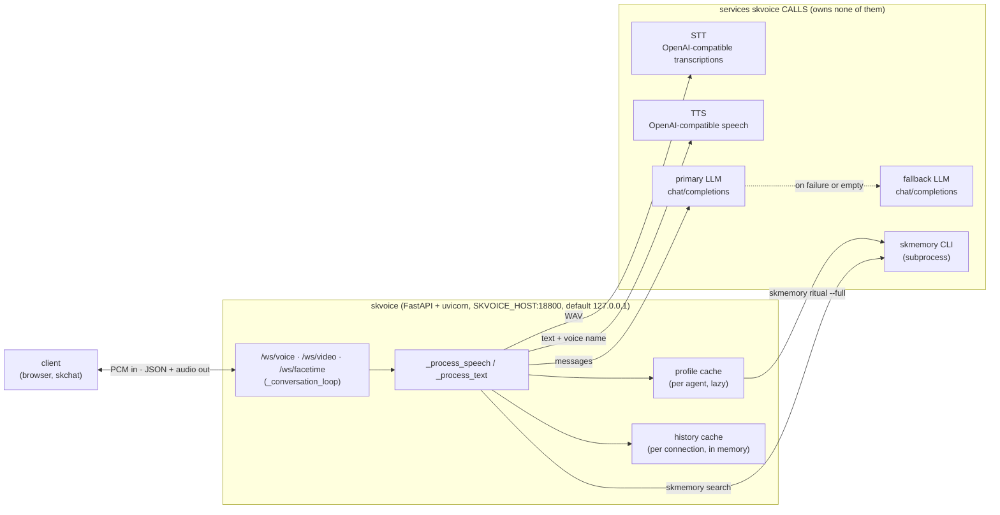
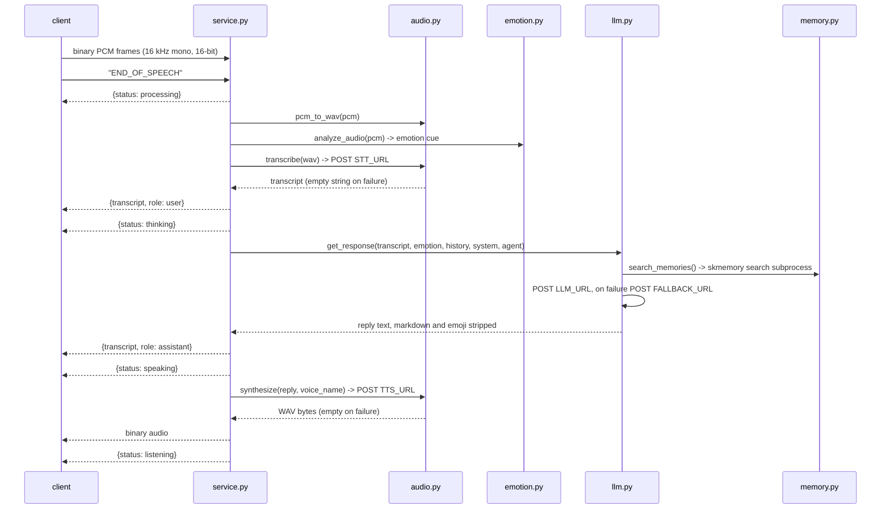

# skvoice - Standard Operating Procedures

skvoice is a **service**: a FastAPI + uvicorn voice orchestrator that **owns no
models**. It calls STT, TTS, and the LLM over HTTP and glues them into one duplex
WebSocket conversation per agent. Callers are browser/app clients and skchat's
voice, video, and FaceTime-fallback pages.

**Kind:** service · **Maturity-tier:** operational · **Crypto-component:** no
(tier T0, no key material) · **License:** GPL-3.0-only (`LICENSE`,
`pyproject.toml:9`)

---

## 1. Overview

### What it is

skvoice turns a microphone stream into a spoken agent reply. A client streams
raw 16 kHz mono PCM over a WebSocket, sends the text sentinel `END_OF_SPEECH`,
and skvoice runs the turn: emotion read on the raw PCM, STT, skmemory pre-fetch,
one LLM call, then TTS back over the same socket as binary audio.

### What it owns

- The **per-agent WebSocket protocol** and the connection state machine
  (`skvoice/service.py`).
- The **turn pipeline**: PCM to WAV, emotion cue, STT call, memory pre-fetch,
  LLM call, TTS call, history bookkeeping.
- **Agent identity loading**: it shells out to `skmemory ritual --full` and uses
  that text as the system prompt (`skvoice/agent_profile.py:47`).
- Three transports for the *same* turn: `/ws/voice`, `/ws/video` (identical
  protocol), and `/ws/facetime` (identical turn, 12-byte framed binary,
  `skvoice/facetime.py`).

### What it explicitly does NOT do

- **It hosts no models.** No whisper weights, no TTS weights, no LLM weights, no
  GPU code. Every one of those is an HTTP call to a URL from config. If the STT
  or TTS host is down, skvoice returns an empty transcript or empty audio and
  keeps the socket alive; it does not degrade to a local model.
- **It keeps no durable state.** Conversation history is a process-local dict
  keyed `agent:id(ws)`, bounded to the last 30 entries once it passes 40
  (`skvoice/service.py:388-390`), and lost on restart. There is no database.
- **It performs no cryptography.** No key generation, no signing, no wrapping,
  no key material at rest. See `SECURITY.md`.
- **It does no authentication or authorization.** There is no auth middleware in
  `skvoice/service.py`. Any client that can reach the port can open
  `/ws/voice/{agent}` as any agent. See section 5, Front-end / Exposure.
- **It is not a media server.** No WebRTC, no SFU, no recording. skchat owns
  WebRTC and falls back to skvoice's framed WebSocket when WebRTC fails.

---

## 2. Architecture

### Start here (entry-point files)

| File | Why you start here |
|---|---|
| `skvoice/__main__.py` | The whole entry point, 17 lines. `main()` calls `uvicorn.run("skvoice.service:app", host=Config.HOST, port=Config.PORT)`. The console script `skvoice` points here. |
| `skvoice/service.py` | The FastAPI app: all 3 HTTP routes, all 3 WebSocket routes, `_conversation_loop` (the frame dispatcher), `_process_speech` and `_process_text` (the 12-step turn). |
| `skvoice/config.py` | Every knob. One `Config` class read from env at import time, plus `_resolve_url` (full URL env, then base URL env, then legacy alias, then localhost default). |
| `skvoice/llm.py` | The LLM leg. Two OpenAI-compatible `/v1/chat/completions` endpoints, primary then fallback, plus markdown/emoji stripping so the text speaks cleanly. |
| `skvoice/integration.py` | The only place skvoice touches the wider fleet. Default-on-by-presence: sk-alert, skscheduler health job, discovery registry. Everything guarded by `is_present()`. |

### The pipeline



### One spoken turn



An empty transcript short-circuits back to `listening` without an LLM call
(`skvoice/service.py:366-369`). An empty TTS result logs a warning and still
returns to `listening`; the socket is never torn down for a backend failure.

### Module map

| Module | Role |
|---|---|
| `skvoice/__main__.py` | Console entry point, uvicorn bootstrap |
| `skvoice/service.py` | FastAPI app, routes, frame dispatch, the turn |
| `skvoice/config.py` | Env-driven config, STT/TTS URL resolution |
| `skvoice/agent_profile.py` | `skmemory ritual --full` rehydration, `VOICE_RULES`, soul fallback |
| `skvoice/memory.py` | `skmemory search` pre-fetch, `skmemory snapshot` save |
| `skvoice/llm.py` | Primary and fallback OpenAI-compatible chat calls, formatting strip |
| `skvoice/audio.py` | `pcm_to_wav`, `transcribe` (STT POST), `synthesize` (TTS POST) |
| `skvoice/emotion.py` | RMS, zero-crossing, autocorrelation pitch, to a one-line cue |
| `skvoice/facetime.py` | 12-byte little-endian framing shim for the skchat FaceTime fallback |
| `skvoice/integration.py` | Optional skcapstone adapter (sk-alert, skscheduler, registry) |

### Known drift in this repo (read before trusting the other docs)

First recorded 2026-08-14. Items 1 and 2 were **resolved** by deleting the dead
code (card `169a81d2`); they are kept here so the history is legible.

1. ~~**`skvoice/tools.py` is dead code.**~~ **RESOLVED: the module was deleted.**
   It defined five tools (`search_memory`, `save_memory`, `web_search`,
   `dispatch_agent`, `cloud9_status`) that `README.md` and
   `docs/ARCHITECTURE.md` advertised as live features. Nothing imported it,
   and `llm.py` has no tool loop, so none of them had run since v0.2.6.
   Re-verified before deletion: a grep for `from skvoice.tools`,
   `from skvoice import tools`, `import skvoice.tools`, `VOICE_TOOLS`, and
   `handle_tool` across every `.py` under `~/clawd` found no importer, and
   `tests/` never referenced it. Memory is still reached, but only through the
   unconditional pre-fetch in `llm.get_response`, never as a model-callable
   tool. **If you want tools back, write them against the current
   OpenAI-compatible `llm.py`; do not resurrect the Anthropic-format
   definitions from git history.**
2. ~~**The `anthropic>=0.40` dependency is a leftover.**~~ **RESOLVED: dropped
   from `pyproject.toml`** in the same change. The SDK path was retired in
   v0.2.6; both LLM legs are plain OpenAI-compatible `/v1/chat/completions`
   over `httpx`, and `grep -rni anthropic skvoice/` now matches only a prose
   mention in `llm.py`'s docstring.
3. **`Config.CREDENTIALS_PATH` is unused.** Defined in `config.py`, read by
   nothing since the OAuth path was removed. Still present.
4. **`docs/ARCHITECTURE.md` sections "LLM turn & the tool loop" and "Voice tools"
   describe the retired design.** Both now carry a REMOVED banner rather than a
   STALE one, because the module they document no longer exists. The pipeline,
   WebSocket protocol, agent/ritual, and integration sections of that file are
   still accurate.
5. **The deployed build lags the newest tag.** This is a deploy issue, not a
   code one, and no code change can fix it. See section 5, Rollback and drift.

See section 9 for the remaining follow-ups.

---

## 3. Build

Pure Python, no compiled extensions, no build step for development.

```bash
python3 -m venv .venv && . .venv/bin/activate
pip install -e .                # runtime only
pip install -e ".[dev]"         # plus pytest
pip install -e ".[skcapstone]"  # plus the optional fleet integration backbone
```

Fleet installs go into the shared `~/.skenv` venv, which is what the systemd
unit executes (`ExecStart=%h/.skenv/bin/skvoice`).

Distribution artifacts:

```bash
python -m pip install --upgrade build
python -m build            # sdist + wheel into dist/
```

**The version is not written anywhere in the tree.** It is derived from the git
tag by setuptools-scm (`pyproject.toml:29-31`), written to
`skvoice/_version.py` at build time, and read back at runtime by
`skvoice/__init__.py`. Two consequences:

- A **shallow clone has no tags**, so setuptools-scm falls back to
  `0.0.0+unknown` and the build is not publishable. Every checkout that builds
  must use `fetch-depth: 0` and `fetch-tags: true`.
- **Never hardcode a version** in `pyproject.toml` or `__init__.py`. It drifts,
  and it rebuilds an already-published release, which PyPI rejects with a 400
  after the tag has already been cut.

---

## 4. Test

```bash
pip install -e ".[dev]"
python -m pytest tests/ -q
```

Expected on a clean machine: **2 passed, 4 skipped**. The 4 skips are the
integrated-mode cases in `tests/test_integration_adapter.py`; they run only when
the optional `skcapstone` package is importable.

### The green-bar gate

`.github/workflows/ci.yml` runs exactly that command on every push and pull
request across Python 3.10, 3.11, and 3.12. It has no `continue-on-error`, so a
red suite blocks the PR. **That is the gate.**

### Do not cite publish.yml as a test gate

`.github/workflows/publish.yml` also has a `test` job, and it cannot fail:

- `publish.yml:43` sets `continue-on-error: true` on the pytest step.
- `publish.yml:41` runs `pip install -e ".[dev]" || pip install -e .`. Before
  this change there was no `dev` extra, so the first half always failed, the
  fallback installed no pytest, and `python -m pytest` died on "No module named
  pytest" into a swallowed exit code.
- `publish.yml` triggers only on `push: tags: ["v*"]` and `workflow_dispatch`.
  It never sees an ordinary push or a pull request.

Adding the `dev` extra makes that job actually install and run pytest, but
`continue-on-error` still means it can never block a release. Treat `ci.yml` as
the gate and `publish.yml` as release plumbing.

### Known local false positive

The autouse fixture in `tests/test_integration_adapter.py:34-41` asserts that no
`skvoice_*` file exists in the **real** `~/.skcapstone/config/jobs.d`. On any
host where skvoice is actually running, `integration.ensure_schedule()` has
already written `skvoice_health.yaml` there at service startup, so all six tests
error out with a leak assertion that the tests did not cause. Reproduce a clean
result with an isolated home:

```bash
env -i PATH=/usr/bin:/bin HOME=$(mktemp -d) .venv/bin/python -m pytest tests/ -q
```

CI runners have no `~/.skcapstone`, so this never fires there.

---

## 5. Release / Deploy

### Release

A release is cut by pushing a `v*` tag. `publish.yml` then builds and publishes
to PyPI via Trusted Publishing (OIDC, `owner=smilinTux workflow=publish.yml
environment=pypi`). The publisher is bound to the workflow **filename**, so the
publish step cannot be moved to another file.

Guards already in `publish.yml`, all of which exist because something broke:

- **Refuse a tag that is not on main** (`publish.yml:107-124`), because the local
  pre-push hook is a per-clone symlink and a stale clone kept cutting tags at
  feature-branch tips. `vars.ALLOW_OFF_MAIN_RELEASE=1` bypasses it.
- **Refuse a non-release version** (`publish.yml:128-142`), because a dev or
  local version gets a 400 from PyPI only after the tag is already cut.
- **`always()` on `build` and on `pypi-publish`** (`publish.yml:97-99`,
  `162-163`), because GitHub propagates a skip *through* the job graph: with a
  bare `needs: build`, the publish job evaluates to skipped whenever an ancestor
  skipped, the run reports success, and nothing is uploaded.

⚠️ **`publish.yml` also auto-cuts tags.** The `tag` job (`publish.yml:45-91`)
bumps the patch version and pushes the tag when `github.ref ==
'refs/heads/main'`, which given the triggers means a `workflow_dispatch` run on
main. There is a matching auto-tag hook at `scripts/hooks/pre-push`. Some clones
have it defused by installing it under a name git does not fire. Before pushing
anything from a clone, check `.git/hooks/pre-push` and record the tag baseline
with `git ls-remote --tags origin`.

### Deploy

```bash
cp systemd/skvoice.service ~/.config/systemd/user/
systemctl --user daemon-reload
systemctl --user enable --now skvoice
```

**The installed unit must stay byte-identical to `systemd/skvoice.service`.**
That is the expected state, and it holds today on noroc2027 (`diff
~/.config/systemd/user/skvoice.service systemd/skvoice.service` is empty). Host
differences belong in `~/.config/skvoice/skvoice.env`, which the unit loads with
`EnvironmentFile=-` (leading dash: optional, no failure if absent). Operational
policy that is not portable belongs in a drop-in, not in an edit to the unit.

One drop-in is in use, `skvoice.service.d/restart-storm.conf`, adding
`RestartSteps=8`, `RestartMaxDelaySec=5min`, `StartLimitIntervalSec=30min`,
`StartLimitBurst=5`. It exists because `RestartSec x (Burst - 1) <
StartLimitIntervalSec` is required or the start limiter never engages and a
failing unit retries forever.

Verify:

```bash
systemctl --user is-active skvoice
curl -s localhost:18800/health
journalctl --user -u skvoice -n 50
```

### Rollback

The unit runs whatever `~/.skenv/bin/skvoice` resolves to, so rollback is a pip
downgrade plus a restart:

```bash
~/.skenv/bin/pip install "skvoice==<previous>"
systemctl --user restart skvoice
curl -s localhost:18800/health   # confirm the version field moved back
```

Nothing persists across a restart (history is in memory only), so a rollback
loses in-flight conversations and nothing else. Clients reconnect.

**Deployed-version drift is real and invisible without checking.** On
2026-08-14 the running service reported `"version":"0.2.2"` while the newest
remote tag was `v0.2.8`, and that was **still true on 2026-08-15**. `/health` is
the source of truth for what is actually running; the tag is not.

### Front-end / Exposure

**Tier: internal service. No public `:443` route.**

| Property | Value |
|---|---|
| Bind address | `SKVOICE_HOST`, **default `127.0.0.1`** (`skvoice/config.py`), passed to `uvicorn.run` in `skvoice/__main__.py` |
| Port | `18800` (`SKVOICE_PORT`, default in `skvoice/config.py`) |
| Observed | `ss -tlnp` on noroc2027 on 2026-08-15, still running the pre-fix build: `LISTEN 0.0.0.0:18800 users:(("skvoice",pid=467443))` |
| Public `:443` routes | none |
| Authentication | **none.** No auth middleware exists in `skvoice/service.py` |

⚠️ **Every route on this service is unauthenticated.** `GET /health`,
`GET /voice/agents`, `POST /voice/clear`, and the three WebSockets
`/ws/voice/{agent}`, `/ws/video/{agent}`, `/ws/facetime/{agent}` have no auth
middleware in front of them. **The bind address is therefore the only access
control skvoice has.** Treat widening it as a security decision, not a
convenience setting.

**Bind history.** Until the `SKVOICE_HOST` change, the host was the string
literal `"0.0.0.0"` in the `uvicorn.run` call with no env override, unlike every
other configurable in the service. That deviated from
UNIFIED_INGRESS_STANDARD, which requires a service to bind `127.0.0.1` or a
tailnet address and never a wildcard. The variable now exists and defaults to
loopback.

⚠️ **The running process has not picked this up.** The default change lands in
code; it takes effect on the next reinstall plus restart. Until then `ss` still
shows the wildcard, which is why the observed row above disagrees with the
documented default.

**Actual blast radius, scoped honestly.** On noroc2027 the interfaces are `lo`,
`enp6s18` at `192.168.0.158/16` (LAN), `tailscale0` at `100.108.59.57` (tailnet),
and docker bridges. There is **no public interface**. Internet ingress on this
host is Tailscale Funnel only, and `tailscale funnel status` publishes `/` to
`:8765`, `/daemon` to `:9385`, `/livekit-ws`, one `.well-known/skfed` path, and
two TCP forwards to `localhost:443`. **`:18800` is not among them.** So the
exposure is **LAN plus tailnet, not the internet**.

That is still a real surface. Anyone on the LAN or the tailnet can open
`ws://<host>:18800/ws/voice/lumina` and hold a conversation with an agent whose
system prompt is the full `skmemory ritual --full` output, meaning soul, FEB
emotional state, seeds, and strongest memories. They can also `POST
/voice/clear` to wipe every live conversation, and `GET /voice/agents` to
enumerate every directory under `~/.skcapstone/agents`.

### Deploying the loopback default (read before you reinstall)

**This is a default change, and a narrower default can break a client that was
relying on the old one.** No audit of remote callers has ever been done, so the
list below is what a fleet grep found, not a guarantee.

Callers found by grepping `18800` across `~/clawd`:

| Caller | Address it uses | Survives a loopback bind? |
|---|---|---|
| `skvoice/integration.py` health job | `http://localhost:18800/health` | yes |
| skchat `voice_ws_lite.py` (`SKCHAT_SKVOICE_URL` default) | `ws://127.0.0.1:18800/ws/voice` | yes |
| skchat `facetime.py` (`SKCHAT_SKVOICE_FACETIME_URL` default) | `ws://127.0.0.1:18800/ws/facetime` | yes |
| skchat `deploy/skstack01-stack.yml` | **`ws://192.168.0.158:18800/ws/voice`** | **NO** |
| skchat `deploy/v2/skchat-stack.yml` | `ws://voice:18800/ws/voice` | N/A, that is skchat's own in-container voice service, not this one |

⚠️ **`skstack01-stack.yml` pins the LAN IP `192.168.0.158`, not loopback.** That
manifest is not deployed on noroc2027 right now (`docker stack ls` and
`docker service ls` are both empty, and no skchat container is running), so it
is a latent break, not a live one. **A container reaching the host by LAN IP
cannot reach a loopback listener even on the same box.**

So, before or with the reinstall, do ONE of:

1. Confirm no off-box or containerised client needs `:18800`, and take the
   loopback default. This is the preferred end state.
2. Set `SKVOICE_HOST` explicitly in `~/.config/skvoice/skvoice.env`, preferring
   the host's tailnet address over `0.0.0.0`, and repoint
   `skstack01-stack.yml` at whatever you chose.

**The live unit was deliberately not changed by the code PR.** Editing
`~/.config/skvoice/skvoice.env` or the installed unit is an operator action.

---

## 6. Configuration / Usage

All variables are optional. Set them in the environment, or in
`~/.config/skvoice/skvoice.env`, which the systemd unit loads. `.env.example` is
the annotated template. Config is read **at import time** into class attributes
on `Config`, so a change requires a restart, not a reload.

| Variable | Default (`skvoice/config.py`) | Meaning |
|---|---|---|
| `SKVOICE_HOST` | `127.0.0.1` | Bind address. Loopback by default because no route is authenticated. See section 5 before widening it |
| `SKVOICE_PORT` | `18800` | Listen port |
| `SKVOICE_AGENT` | `lumina` | Agent loaded at startup and used when a route omits the name |
| `SKVOICE_MODEL` | `claude-haiku-4-5` | Model id sent to the primary LLM endpoint |
| `SKVOICE_LLM_URL` | `http://localhost:18783/v1/chat/completions` | Primary LLM, OpenAI-compatible |
| `SKVOICE_FALLBACK_URL` | `http://192.168.0.100:8082/v1/chat/completions` | Fallback LLM, used when the primary errors or returns empty |
| `SKVOICE_FALLBACK_MODEL` | `qwen3.6-27b-abliterated` | Model id for the fallback endpoint |
| `SKVOICE_MAX_TOKENS` | `200` | Per-turn cap. Spoken replies stay short by design |
| `SKVOICE_STT_BASE` | `http://localhost:18794` | STT base URL; `/v1/audio/transcriptions` is appended |
| `SKVOICE_STT_URL` | (unset) | Full STT URL, wins over `_BASE` |
| `SKVOICE_WHISPER_URL` | (unset) | Legacy alias for `SKVOICE_STT_BASE`, still honoured |
| `SKVOICE_TTS_BASE` | `http://localhost:18793` | TTS base URL; `/audio/speech` is appended |
| `SKVOICE_TTS_URL` | (unset) | Full TTS URL, wins over `_BASE` |
| `SKVOICE_AGENT_HOME` | `~/.skcapstone/agents` | Directory scanned by `/voice/agents` and read for souls |
| `SKVOICE_CREDENTIALS_PATH` | `~/.claude/.credentials.json` | **Unused.** Left over from the retired OAuth path |
| `SK_STANDALONE` | (unset) | Any value forces standalone mode even when skcapstone is installed |

Resolution order per service URL (`config._resolve_url`): full URL env, then base
URL env, then legacy alias, then the built-in localhost default.

### Files skvoice reads and writes outside the repo

| Path | Direction | When |
|---|---|---|
| `~/.config/skvoice/skvoice.env` | read | loaded by systemd, not by the code |
| `~/.skcapstone/agents/<agent>/soul/base.json` | read | on first use of an agent, for `voice_name` |
| `~/.skcapstone/agents/<agent>/trust/trust.json` | read | on first use of an agent |
| `~/.skcapstone/config/jobs.d/skvoice_health.yaml` | **write** | at startup, only when skcapstone is importable |
| `~/.skcapstone/registry/skvoice.json` | **write** | at startup, only when skcapstone is importable |

### Integration modes

| Mode | Trigger | Behaviour |
|---|---|---|
| Integrated | `skcapstone` importable and `SK_STANDALONE` unset and `sdk.is_available()` | Alerts to `skvoice.<severity>` on sk-alert; health job registered with skscheduler; service advertised in the discovery registry |
| Standalone | `skcapstone` absent | Structured logging; systemd owns lifecycle |
| Forced standalone | `SK_STANDALONE=1` | Standalone even when skcapstone is installed |

### Distributed deployment

The orchestrator is lightweight and the GPU work is elsewhere, so point it at
the GPU host by tailnet name (survives LAN changes) rather than IP:

```bash
cat > ~/.config/skvoice/skvoice.env <<'EOF'
SKVOICE_PORT=18800
SKVOICE_AGENT=lumina
SKVOICE_STT_BASE=http://skworld-100:18794
SKVOICE_TTS_BASE=http://skworld-100:18793
EOF
systemctl --user restart skvoice
curl -s localhost:18800/health   # stt_url and tts_url echo what was resolved
```

`/health` echoes the resolved `stt_url` and `tts_url`, which is the fastest way
to confirm the env file was actually picked up.

---

## 7. API / Reference

### HTTP

| Method | Path | Source | Returns |
|---|---|---|---|
| GET | `/health` | `service.py:95` | `status`, `service`, `version`, `default_agent`, `port`, `stt_url`, `tts_url`, `model` |
| POST | `/voice/clear` | `service.py:110` | `{status, cleared}`, drops **all** in-memory histories for **all** connections |
| GET | `/voice/agents` | `service.py:118` | `{agents: [...]}`, directory names under `Config.AGENT_HOME` |

```bash
curl -s localhost:18800/health
curl -s localhost:18800/voice/agents
curl -s -X POST localhost:18800/voice/clear
```

### WebSocket

| Path | Source | Notes |
|---|---|---|
| `/ws/voice/{agent_name}` | `service.py:130` | The reference protocol |
| `/ws/video/{agent_name}` | `service.py:137` | **Identical protocol**, same `_conversation_loop`. Shares the loop deliberately so the two cannot drift |
| `/ws/facetime/{agent_name}` | `service.py:151` | Same turn, wrapped in `FaceTimeSocket`: binary frames get a 12-byte little-endian header (`uint32` frame type, `uint32` timestamp ms, `uint32` payload length), `0x01` JPEG video and `0x02` audio. JSON control frames are unchanged |

`{agent_name}` defaults to `lumina`.

**Client to server frames:**

| Frame | Effect |
|---|---|
| binary | Appended to the PCM buffer for the current utterance (16 kHz mono, 16-bit signed) |
| `END_OF_SPEECH` | Run the full speech pipeline on the buffered PCM |
| `CLEAR_HISTORY` | Reset this connection's history only |
| `{"type":"text_message","text":...}` | Text turn: skip STT and emotion, run LLM then TTS. The user's text is **not** echoed back, the client already rendered it |
| `{"type":"inject_session","messages":...,"emotion_state":...}` | Restore a cached conversation, capped at 40 and trimmed to 30 |
| `{"type":"group_init","peers":[...]}` | Append a one-shot multi-agent suffix to this connection's system prompt |
| `{"type":"group_context","from":...,"text":...}` | Buffer a peer agent's line, prepended to this agent's next turn |

**Server to client frames:** JSON `status` (`processing`, `thinking`,
`speaking`, `listening`, `history_cleared`), `transcript` (`role` plus `text`),
`group_ready`, `session_restored`, `error`, plus raw binary audio.

### Python surface

`skvoice` is a service, not a library. The importable pieces are internal:
`skvoice.config.Config`, `skvoice.audio.{pcm_to_wav,transcribe,synthesize}`,
`skvoice.llm.get_response`, `skvoice.agent_profile.load_agent_profile`, and the
adapter API in `skvoice.integration` (`is_present`, `alert`, `ensure_schedule`,
`unregister_schedule`, `register_self`). Only `skvoice.integration` has a
documented contract and tests; treat the rest as private.

---

## 8. Troubleshooting

| Symptom | Check |
|---|---|
| Nothing on `:18800` | `systemctl --user is-active skvoice`, then `journalctl --user -u skvoice -n 100`. A `203/EXEC` means `~/.skenv/bin/skvoice` is missing: reinstall into `~/.skenv` |
| Service flaps and then gives up | `systemctl --user show skvoice -p RestartSec -p StartLimitIntervalSec -p StartLimitBurst`. `RestartSec x (Burst - 1)` must be **less** than `StartLimitIntervalSec` or the limiter never engages. That is what `restart-storm.conf` fixes |
| Client connects, agent never answers | `curl -s localhost:18800/health` and read `stt_url`. Then curl that URL from **this host**; a remote GPU box unreachable over the tailnet yields an empty transcript, which short-circuits before the LLM (`service.py:366`) |
| Transcript appears, no audio comes back | `journalctl --user -u skvoice \| grep "TTS failed"`. `audio.synthesize` swallows the exception and returns `b""`; the log line is the only signal |
| Agent answers as a generic assistant, not itself | `journalctl --user -u skvoice \| grep ritual`. `agent_profile.py` logs "no ritual, no soul" when both are unavailable. Confirm `skmemory` is on `PATH` or in `~/.skenv/bin`, and that `~/.skcapstone/agents/<agent>/` exists |
| `"I'm having trouble connecting right now"` | Both LLM legs failed. `journalctl --user -u skvoice \| grep -E "Primary LLM\|Fallback LLM"` prints the URL and model for each. Verify `SKVOICE_LLM_URL` and `SKVOICE_FALLBACK_URL` are reachable from this host |
| `/health` version does not match the newest tag | The installed package is behind. `~/.skenv/bin/pip show skvoice`, then upgrade and restart. `/health` is the truth, the tag is not |
| Env file edits have no effect | Config is read at import time. `systemctl --user restart skvoice`. Also confirm the path is exactly `~/.config/skvoice/skvoice.env`: the unit uses `EnvironmentFile=-`, so a wrong path fails **silently** |
| `/ws/video` or `/ws/facetime` returns 403 | An old build predating `facetime.py`. Check `/health` version and upgrade |
| Tests error with "Integration test leaked files" | Not a real failure on a host running skvoice. See section 4, Known local false positive |
| Config change looks live but is not | `systemctl --user cat skvoice` shows the **effective** unit including drop-ins. A drop-in can override an `Environment=` line from the unit |

---

## 9. Maturity-tier + Version reference

**Maturity-tier: operational.** Deployed as a systemd user unit on noroc2027,
enabled and active, with no unit drift from the repo. It has a real test suite
(small), a real secret-scan gate over full history, and a real CI gate. It is
**not hardened: there is still no authentication on any route.** The bind now
defaults to loopback, which contains the exposure but does not authenticate
anything.

**Crypto-component: no.** Tier T0, N/A, no key material. See `SECURITY.md`.

### Version

**Do not quote a version number from this repo.** There is none in the tree. The
version comes from the git tag via setuptools-scm (`pyproject.toml:29-31`),
which writes `skvoice/_version.py` at build time; `skvoice/__init__.py` prefers
installed package metadata and falls back to that file, then to
`0.0.0+unknown`.

To learn a version, ask a specific thing:

| Question | Command |
|---|---|
| What is running? | `curl -s localhost:18800/health` and read `version` |
| What is installed? | `~/.skenv/bin/pip show skvoice` |
| What is released? | `git ls-remote --tags origin \| grep -v '\^{}'` |
| What would a build here produce? | `python -m setuptools_scm` |

These four routinely disagree. On 2026-08-14 the running service reported
`0.2.2` while the newest remote tag was `v0.2.8`. **Re-checked 2026-08-15: both
still hold**, so the deployed build is six releases behind. `/health` returns
`"version":"0.2.2"` and `git ls-remote --tags origin` still tops out at
`v0.2.8`. **This is a deploy issue and no code change can fix it**; the operator
action is a reinstall plus restart, which is also what picks up the
`SKVOICE_HOST` default (read section 5 first).

### Follow-ups

Done, in the `SKVOICE_HOST` + dead-code change (cards `44e05250`, `169a81d2`):

- ~~Make the uvicorn bind host configurable and default it to loopback.~~
- ~~Decide `skvoice/tools.py`: rewire or delete.~~ Deleted.
- ~~Drop the unused `anthropic>=0.40` dependency.~~
- ~~Rewrite the stale `docs/ARCHITECTURE.md` tool sections.~~ Marked REMOVED
  rather than rewritten: there is nothing to describe now.
- ~~Move `docs-check.yml` to `tiers: "1,2,3"`.~~ Done separately.

Still open, each needing an operator decision and its own card:

1. **Reinstall the deployed build.** `/health` reports a version several
   releases behind the newest tag. No code change fixes this; see "Version".
2. **Take the loopback default on this host**, or set `SKVOICE_HOST` explicitly
   in the env file. See section 5, "Deploying the loopback default". The code
   PR did not touch the live unit.
3. **Authenticate the routes.** The bind default contains the exposure; it does
   not authenticate anything, and the ingress standard wants both.
4. Drop the unused `Config.CREDENTIALS_PATH`.
5. Consider removing `continue-on-error: true` from `publish.yml` now that
   `ci.yml` is the gate, so a release cannot ship on a red suite.
6. Fix the `tests/test_integration_adapter.py` leak-check so it does not
   false-positive on a host where skvoice is running. It asserts that no file
   matching its prefix exists under `~/.skcapstone/config/jobs.d`, but a host
   actually running skvoice has a real `skvoice_health.yaml` there. On such a
   host 6 tests error; with a clean `HOME`, as on a CI runner, all 6 pass.

### Unverified / needs an operator pass

- **`skvoice.skworld.io`** does not resolve from noroc2027, re-checked
  2026-08-15 with `getent hosts skvoice.skworld.io` (no output). Whether it
  resolves from anywhere else was **not** tested; no request was made to the
  public internet. The README footer now marks it planned rather than live.
- **Whether any client depends on the wildcard bind.** ⚠️ **Still not fully
  audited, and this is the main risk in the bind change.** A grep of `~/clawd`
  for `18800` found the callers tabulated in section 5. Four use loopback and
  are safe; skchat's `deploy/skstack01-stack.yml` pins `192.168.0.158` and
  would break, though that stack is not currently deployed here. **A grep is
  not an audit**: it cannot see a client outside `~/clawd`, on another node, in
  a browser bookmark, or in a hand-run command. Nothing was tested against the
  live socket. Confirm before reinstalling.
- **The GPU-side STT and TTS services** are out of this repo's scope and were
  not exercised. On noroc2027, `18793` and `18794` are not listening locally;
  the deployed env file points STT at a remote host and TTS at `localhost:18797`,
  neither of which matches the documented defaults. Defaults are documented from
  `config.py`; the deployed values from `/health`.
- **Behaviour under concurrent connections to the same agent.** History is keyed
  per connection so they should not collide, but this was not load tested.

---

<!-- docs-evidence
verified: 2026-08-15
checks:
  - name: console entry point still points at skvoice.__main__:main
    run: grep -q 'skvoice = "skvoice.__main__:main"' pyproject.toml
  - name: documented default port 18800 matches config.py
    run: grep -q 'SKVOICE_PORT", "18800"' skvoice/config.py
  - name: the bind host comes from Config, not a hardcoded literal
    run: grep -q 'host=Config.HOST' skvoice/__main__.py && ! grep -q '0\.0\.0\.0' skvoice/__main__.py
  - name: the documented SKVOICE_HOST default is loopback, per section 5
    run: grep -q 'SKVOICE_HOST", "127.0.0.1"' skvoice/config.py
  - name: the shipped unit does not silently re-widen the bind
    run: ! grep -qE '^[[:space:]]*Environment=SKVOICE_HOST' systemd/skvoice.service
  - name: unit file present with the documented ExecStart
    run: grep -q 'ExecStart=%h/.skenv/bin/skvoice' systemd/skvoice.service
  - name: unit loads the documented optional EnvironmentFile
    run: grep -q 'EnvironmentFile=-%h/.config/skvoice/skvoice.env' systemd/skvoice.service
  - name: all three documented websocket routes exist
    run: for r in voice video facetime; do grep -q "@app.websocket(\"/ws/$r/{agent_name}\")" skvoice/service.py || exit 1; done
  - name: documented default model matches config.py
    run: grep -q 'SKVOICE_MODEL", "claude-haiku-4-5"' skvoice/config.py
  - name: license is GPL-3.0-only as documented, not or-later
    run: grep -q 'license = "GPL-3.0-only"' pyproject.toml
  - name: the dead tools.py stays deleted and is not reintroduced unwired
    run: test ! -e skvoice/tools.py
  - name: no VOICE_TOOLS or handle_tool surface came back without a tool loop
    run: ! grep -rq 'VOICE_TOOLS\|def handle_tool' skvoice/
  - name: the unused anthropic dependency stays dropped
    run: ! grep -qE '^[[:space:]]*"anthropic' pyproject.toml
  - name: version stays setuptools-scm derived, never hardcoded
    run: grep -q 'dynamic = \["version"\]' pyproject.toml && grep -q 'tool.setuptools_scm' pyproject.toml && ! grep -qE '^version[[:space:]]*=' pyproject.toml
  - name: the ci.yml pytest gate has no continue-on-error escape
    run: test -f .github/workflows/ci.yml && ! grep -qE '^[[:space:]]*continue-on-error' .github/workflows/ci.yml
-->
