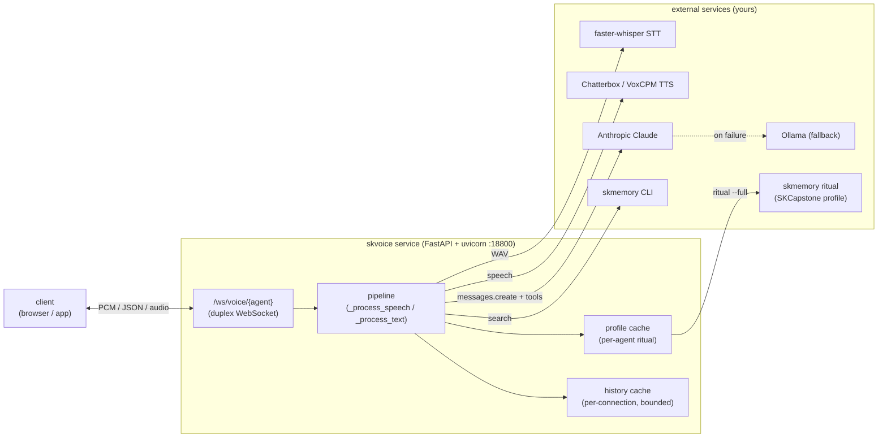
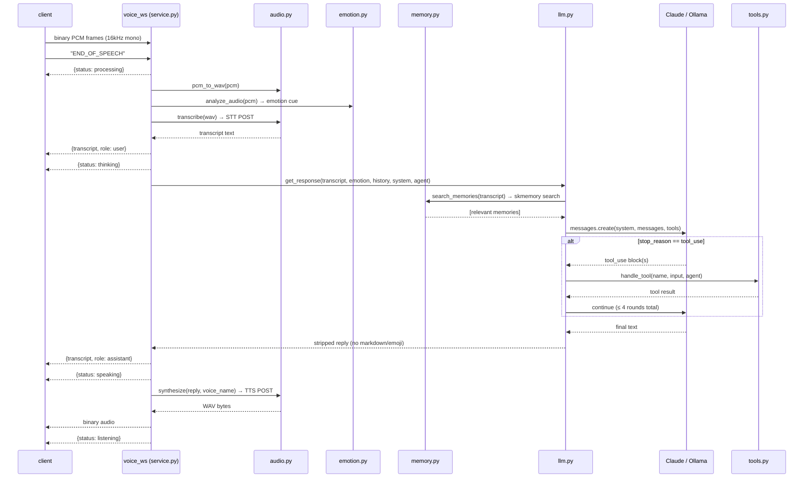
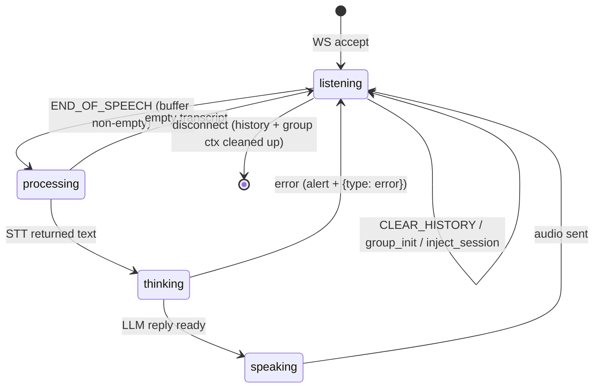
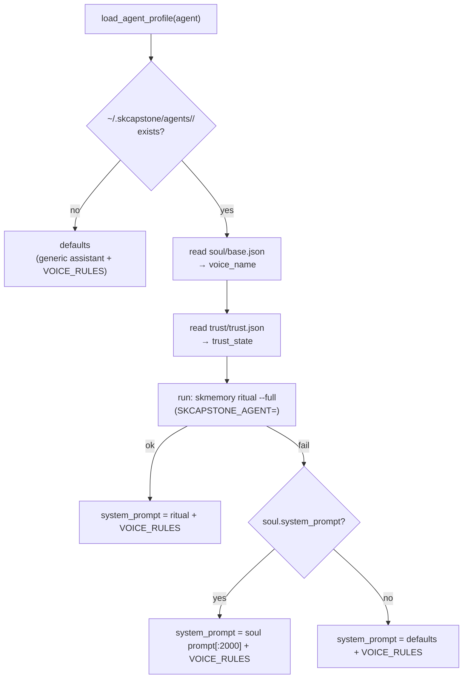
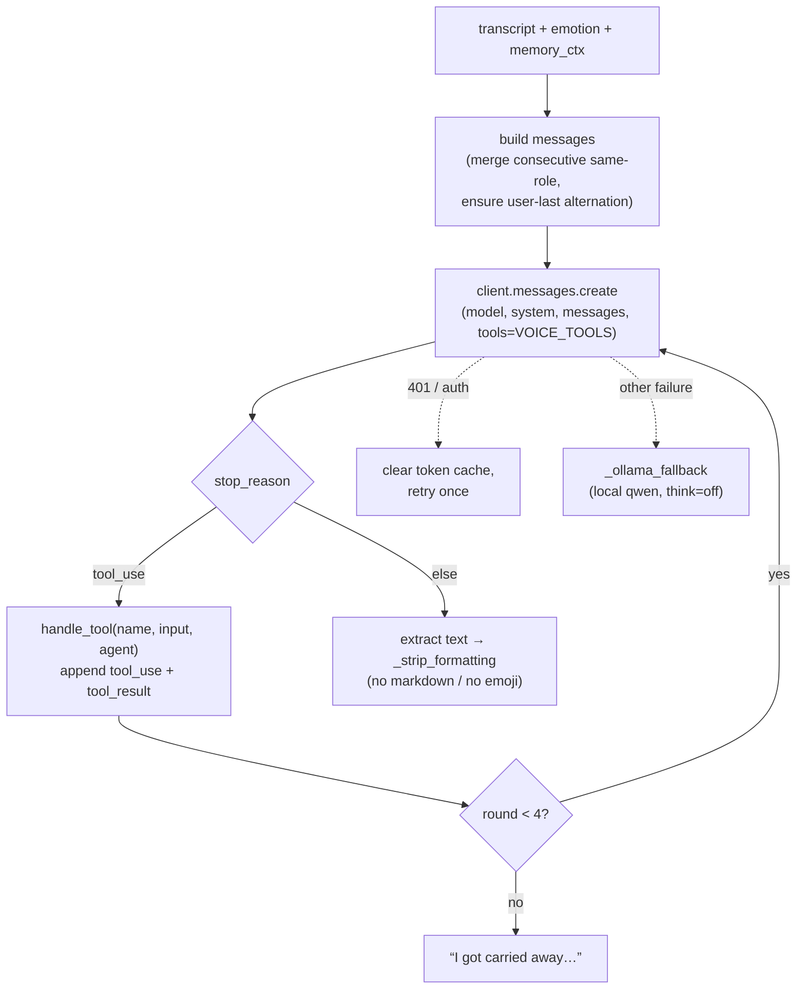
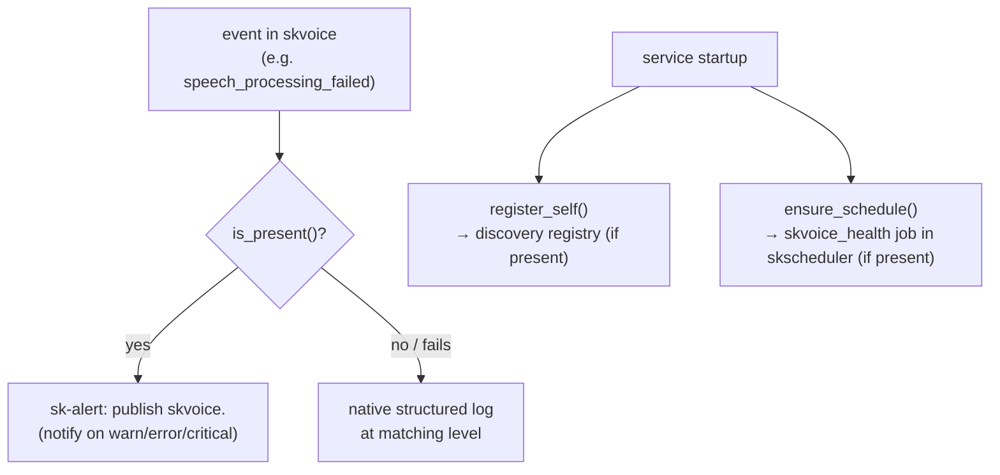
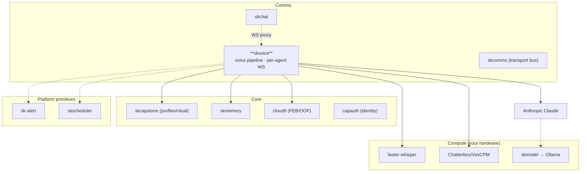

# skvoice Architecture

> ⚠️ **Accuracy note, 2026-08-14.** This document was written at v0.2.5. One
> release later, v0.2.6 retired the Anthropic SDK and the Claude OAuth path in
> favour of two plain OpenAI-compatible `/v1/chat/completions` endpoints, and
> this file was never updated. Two sections below therefore describe a design
> that **no longer runs**: **"LLM turn & the tool loop"** and **"Voice tools
> (`tools.py`)"**. In particular, nothing imports `skvoice/tools.py` today, so
> the tool loop is not wired in at all. Everything else here (the pipeline, the
> WebSocket protocol and state machine, the agent/ritual model, the source map,
> networking, and the integration adapter) was re-verified against the code and
> is accurate. For the current LLM leg and the exposure posture, read
> [`../SOP.md`](../SOP.md). Rewriting the two stale sections is tracked as a
> follow-up in SOP.md section 9.

skvoice is an **orchestrator**, not a model host. It owns no STT, TTS, or LLM
weights, and keeps no durable state — conversation histories live in memory and
are dropped on disconnect. Everything it does is glue: take audio in over a
WebSocket, call the local STT engine, enrich the transcript (emotion + memory),
run a tool-using LLM turn, call the local TTS engine, stream audio back. The
agent it speaks as — its soul, voice, memories, and emotional state — comes
entirely from the SKCapstone agent profile it loads at runtime.

This document covers the pipeline, the WebSocket protocol and connection state
machine, the agent/memory model, the LLM + tool loop, the integration adapter,
and where skvoice sits in SKStack v2.

## The shape of it

## Request lifecycle — one spoken turn

The core path is `voice_ws` → `_process_speech` in `service.py`. A complete
utterance flows through twelve steps; the client signals end-of-utterance with a
text `END_OF_SPEECH` frame after streaming binary PCM.

Key details, grounded in the source:

- **Emotion cue** (`emotion.py`) is computed on the raw PCM *before* STT: RMS
  energy, zero-crossing rate, and an autocorrelation pitch estimate (70–400 Hz)
  map to tags (`energetic` / `calm`, `rapid_speech` / `slow_speech`,
  `high_pitch` / `low_pitch`) that become a one-line prefix like
  `[Speaker sounds energetic, speaking quickly]`. If no tags fire, nothing is
  added.
- **Memory pre-fetch** (`memory.py`) runs `skmemory search <transcript>
  --limit 3` with `SKCAPSTONE_AGENT=<agent>` set, and prepends any hits to the
  user message as `[Relevant memories: …]`. It locates the `skmemory` binary
  across `~/chatterbox-env/bin`, `~/.skenv/bin`, then `PATH`.
- **History** is per-connection (keyed `agent:id(ws)`), bounded to the last 30
  entries once it exceeds 40, and recorded with the emotion cue and any peer
  context the agent actually saw — so the transcript reflects the agent's real
  view of the turn.
- **Text path** (`_process_text`) skips STT and emotion entirely: a
  `text_message` JSON frame goes straight to the LLM + TTS. The user's text is
  *not* echoed back as a transcript (the client already rendered it).

## WebSocket protocol & connection state machine

`/ws/voice/{agent}` is a single duplex channel. The client sends binary PCM and
JSON/text command frames; the server replies with JSON status/transcript
messages and binary audio. The status messages drive a small client-side state
machine.

Frames the server understands (text or JSON):

| Frame | Effect |
|---|---|
| binary | Appended to the PCM buffer for the current utterance |
| `END_OF_SPEECH` | Run the full speech pipeline on the buffered PCM |
| `CLEAR_HISTORY` | Reset this connection's conversation history |
| `{type: text_message, text}` | Text turn — skip STT, run LLM + TTS |
| `{type: inject_session, messages, emotion_state}` | Restore a cached conversation (capped to 40, trimmed to 30) |
| `{type: group_init, peers}` | Append a one-shot multi-agent suffix to the system prompt for this connection |
| `{type: group_context, from, text}` | Buffer a peer agent's line to prepend to this agent's next turn |

Server → client message types: `status` (`processing`/`thinking`/`speaking`/
`listening`/`history_cleared`), `transcript` (`role` + `text`), `group_ready`,
`session_restored`, `error`, plus raw binary audio.

### Multi-agent group chat

`group_init` tells an agent which peers share the room; `_build_group_system_suffix`
adds an instruction block so the agent knows it isn't alone and how to read peer
lines. Peer turns arrive as `group_context` frames, are buffered per connection,
and `_drain_group_context` flattens them into a `[from <agent>]: …` block
prepended to the next user turn — so each agent reacts to the wider conversation
without polluting its own history with assistant turns it never produced.

## Agent profile & ritual

An agent profile is loaded lazily on first use and cached (`_get_profile`). The
load (`agent_profile.load_agent_profile`) does the following:

The **ritual** is the magic: `skmemory ritual --full` rehydrates the agent's
full self — soul blueprint, FEB emotional state, seeds, germination prompts,
strongest memories — and that text becomes the system prompt. `VOICE_RULES` is
always appended: keep replies to 1–3 short spoken sentences, no markdown, no
emoji, use contractions, be warm and conversational. Without skmemory/SKCapstone,
skvoice falls back to the soul's static prompt, then to a generic assistant — it
never hard-fails on a missing dependency.

`voice_name` (from `soul/base.json`, default = agent name) is what the TTS
adapter sends as the `voice` field, so each agent speaks in its own cloned voice.

## LLM turn & the tool loop

> ⚠️ **STALE as of v0.2.6.** This section and the "Voice tools" section that
> follows describe the retired Anthropic SDK design. The current `llm.py` has no
> tool loop, no OAuth handling, and no Ollama call: it POSTs to
> `Config.LLM_URL` and, on failure or empty text, to `Config.FALLBACK_URL`, both
> OpenAI-compatible. `skvoice/tools.py` is not imported by anything. Kept here
> only as a record of the previous design. See [`../SOP.md`](../SOP.md) § 2.

`llm.get_response` builds the message list, pre-fetches memory, and runs a
bounded agentic loop against Claude (`llm.py`):

- **Auth** (`_get_client`): reads the Claude OAuth token + expiry from
  `~/.claude/.credentials.json` (handles ms vs s and ISO expiry), caches the
  client until 5 minutes before expiry, and re-reads the file each refresh (a
  token watcher may rewrite it). On a `401`/auth error the cache is cleared and
  the turn is retried once. The SDK client is created with the
  `claude-code`/`oauth` beta headers; if the `anthropic` SDK isn't importable,
  raw `httpx` is used (`_simple_response`, no tools).
- **Tools** are Anthropic `tool_use`; the loop runs at most 4 rounds before
  bailing with a graceful line. Final text is stripped of markdown and emoji so
  it speaks cleanly.
- **Fallback** (`_ollama_fallback`): on any unrecovered failure, the messages
  are flattened to plain text and sent to local Ollama (`/api/chat`, `think:
  false`, trimmed system prompt) so the agent still answers when Claude is
  unreachable.

### Voice tools (`tools.py`)

> ⚠️ **NOT WIRED IN.** Nothing imports `skvoice/tools.py`. None of the tools
> below are reachable by the model today. Memory is still consulted, but only
> through the unconditional pre-fetch in `llm.get_response`.

| Tool | What it does | How |
|---|---|---|
| `search_memory` | Deep recall on demand | `skmemory search <q> --limit 5` |
| `save_memory` | Persist a meaningful moment | `skmemory snapshot <content> --tag <tags>` |
| `web_search` | Current info | SearXNG (`skpeek.skstack01.douno.it`) JSON, top 5 |
| `dispatch_agent` | Delegate to a swarm specialist | `openclaw agent --agent <a> --message <task> --json` (artisan/coder/architect/scholar/herald/sentinel/steward) |
| `cloud9_status` | Read emotional state | parses `trust/trust.json` + newest `trust/febs/*.feb` (primary emotion, valence, Cloud 9 / OOF, bond, topology) |

Tool subprocesses run with `SKCAPSTONE_AGENT=<agent>` in the environment and a
short timeout, so each tool operates in the calling agent's namespace.

## Source map

| Module | Role |
|---|---|
| `skvoice/__main__.py` | Console entry point — `uvicorn.run(skvoice.service:app, 0.0.0.0:PORT)` |
| `skvoice/service.py` | FastAPI app, `/health`, `/voice/agents`, `/voice/clear`, the `/ws/voice/{agent}` WebSocket, the speech/text pipelines, group-chat & session-injection handling, caches |
| `skvoice/config.py` | Env-driven config + STT/TTS URL resolution (full-URL > base-URL > legacy alias > default) |
| `skvoice/agent_profile.py` | Profile loader + `skmemory ritual --full` rehydration + `VOICE_RULES` |
| `skvoice/memory.py` | `skmemory search` pre-fetch + `skmemory snapshot` save |
| `skvoice/llm.py` | Memory-aware turn against an OpenAI-compatible primary, then a sovereign fallback on failure or empty text; formatting strip |
| `skvoice/tools.py` | `VOICE_TOOLS` definitions + `handle_tool` dispatch. **Not imported by anything since v0.2.6** |
| `skvoice/audio.py` | PCM→WAV, STT POST (`transcribe`), TTS POST (`synthesize`) |
| `skvoice/emotion.py` | RMS / ZCR / autocorrelation-pitch analysis → emotion tags + cue string |
| `skvoice/integration.py` | Optional skcapstone adapter — sk-alert, skscheduler health job, discovery registry |
| `systemd/skvoice.service` | systemd user unit (standalone lifecycle) |
| `scripts/musetalk-install.sh`, `docs/MUSETALK-INSTALL-PLAN.md` | Optional MuseTalk (talking-head) install path |

## Networking & URL resolution

skvoice never hardcodes the GPU host. `config._resolve_url` resolves each
service URL in priority order — full URL env (`SKVOICE_{TTS,STT}_URL`) → base
URL env (`SKVOICE_{TTS,STT}_BASE`, with the standard path appended) → legacy
alias (`SKVOICE_WHISPER_URL`) → built-in `localhost` default — so a single
`SKVOICE_STT_BASE=http://skworld-100:18794` is enough to point the whole
pipeline at a remote GPU box over Tailscale or LAN. The orchestrator is
stateless and lightweight, so you run one per agent against a shared
STT/TTS backend.

## Integration adapter (default-on-by-presence)

`integration.py` is the only place skvoice touches the wider fleet, and it is
strictly optional. `skcapstone` lives in the `[skcapstone]` extra; every call is
guarded by `is_present()` (importable **and** `SK_STANDALONE` unset **and**
`sdk.is_available()`), and any failure degrades to native behaviour.

- **Alerts** use severity-based topics (`skvoice.<severity>`); the semantic
  event name rides in the payload, so the fleet's `*.error`/`*.critical` routing
  works while detail is preserved. The speech and text error paths in
  `service.py` emit `speech_processing_failed` / `text_processing_failed`.
- **`ensure_schedule()`** writes a `jobs.d/skvoice_health.yaml` drop-in that
  curls `/health` on an interval, so the skcapstone daemon owns the cadence and
  central retry/notify; idempotent on every startup.
- **`register_self()`** advertises skvoice (with `health_url` + pid file) to the
  discovery registry.

In standalone mode none of this runs — structured logging plus the systemd
`skvoice.service` unit carry the load.

## Where it lives in SKWorld

skvoice is the **Comms / voice** capability: the spoken-word transport, peer to
skchat (text) under skcomms. It consumes **Core** (SKCapstone profiles +
skmemory + cloud9 for who the agent *is*) and **Compute** (your GPU STT/TTS, and
skmodel/Ollama as LLM fallback), and is deployed like every other sk\* service
through skos.

---

Part of the **[SKWorld](https://skworld.io)** sovereign ecosystem · 🐧 smilinTux
